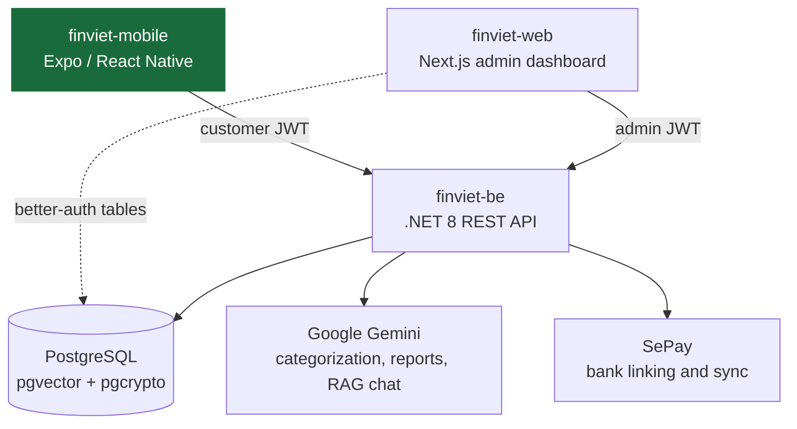

<p align="center">
  
</p>

<h1 align="center">FinViet Mobile</h1>

<p align="center">
  The Expo and React Native app for FinViet, a personal-finance tracker for the Vietnamese market.
  Vietnamese-language interface, four ways to log a transaction, and an AI layer that scores and
  explains spending.
</p>

<p align="center">
  
  
  
  
  
</p>

## What it does

Most personal-finance apps ask people to type in every transaction, which is why most people stop using them within a week. FinViet reduces that friction: a transaction can be entered manually, pasted in from a bank SMS, photographed as a receipt, imported from a bank CSV export, or synced automatically from a linked bank account.

On top of that data the app shows a needs/wants/savings breakdown with pacing, per-category budgets, savings goals, an AI spending score, a weekly report, and a chatbot that answers questions about the customer's own money. Every screen talks to the live .NET backend. There is no mock data layer in this codebase.

## Part of FinViet

FinViet is three repositories:

| Repo | Role |
| --- | --- |
| [finviet-mobile](https://github.com/FinViet-Capstone/finviet-mobile) | This repo. The customer-facing app. |
| [finviet-be](https://github.com/FinViet-Capstone/finviet-be) | The .NET 8 API and PostgreSQL database powering every screen here. |
| [finviet-web](https://github.com/FinViet-Capstone/finviet-web) | Next.js admin dashboard. Internal operations and system configuration. |



## Features

- **Onboarding and auth** — email and password sign-up with email verification, Google sign-in, password reset, and an onboarding flow that seeds the customer's category set and monthly income allocation.
- **Four entry methods behind one button** — manual entry, bank SMS paste, receipt photo capture in batches of up to five, and CSV import from a bank export. The three assisted methods send their input to the backend, then show a review list where the customer edits the extracted amount, merchant, date, and category before anything is saved.
- **Wallets** — multiple wallets per customer, manual or bank-linked through SePay, with wallet-to-wallet transfers recorded as a linked pair that reverses on either side when deleted.
- **Transaction history** — filterable list with per-transaction detail, edit, reclassify, and delete.
- **Budgets** — per-category monthly limits with safe, warning, and danger states, alongside bucket-level pacing that compares spend to how much of the month has elapsed rather than to a flat total.
- **Savings goals** — goals with a target, an optional deadline, and an optional funding wallet, with contribution and withdrawal flows and a derived monthly amount needed to finish on time.
- **AI layer** — a spending score with its breakdown, an AI-labeled weekly report, and a chat advisor, all computed from the customer's real transactions on the backend.
- **Settings** — category management with drag-between-bucket assignment, budget allocation percentages, AI preferences, data export, notification history, and account deletion.
- **Push notifications** — Expo notifications for weekly reports and budget alerts, with an in-app notification centre.

## Tech stack

Expo 57 and React Native 0.86 with the New Architecture enabled, TypeScript in strict mode. Expo Router for file-based navigation. TanStack Query for server state and Zustand for client state. React Hook Form with Zod for form validation. Axios for the API client. Expo Secure Store for tokens. React Native Gifted Charts for visualizations. Sentry for crash reporting. Jest with React Native Testing Library for unit tests and Maestro for end-to-end flows. EAS Build for native builds.

## Getting started

### Prerequisites

- Node.js 20 or newer
- A running instance of [finviet-be](https://github.com/FinViet-Capstone/finviet-be), reachable from your device or emulator
- Android Studio or Xcode. This app uses native modules, so Expo Go is not enough; you need a development build.

### Run it

```bash
npm install
cp .env.example .env.local
```

Set `EXPO_PUBLIC_API_BASE_URL` in `.env.local` to your backend, including the `/api` suffix. Use `http://10.0.2.2:5122/api` for an Android emulator, or your machine's LAN address for a physical device. The remaining keys in `.env.example` are optional and gate individual integrations: leave `EXPO_PUBLIC_SENTRY_DSN` empty to disable crash reporting locally, and SePay bank linking stays unavailable without a client ID.

```bash
npm run android   # or: npm run ios
```

Both commands compile a native development build the first time and take a while. After that, `npm start` is enough.

### Verification loop

```bash
npm run type-check
npm run lint
npm test
```

There is no JS bundling step in day-to-day development, so those three commands are the standard check before committing. Tests live in `__tests__/` directories beside the code they cover. Maestro end-to-end flows are in `.maestro/flows/`.

## Limitations and what's next

- **Not released.** EAS build profiles for development, preview, and production are configured, but nothing has been submitted to TestFlight or Google Play. There are no real users yet, so every screen reflects development data.
- **Subscriptions are not reachable.** Plans exist in the backend and are admin-manageable, but there is no customer-facing purchase contract to build against, so the app has no upgrade flow at all rather than a fake one.
- **The interface is Vietnamese-only.** Copy is hard-coded rather than routed through an internationalization layer, which is fine for the target market and would need reworking before any second locale.
- **End-to-end coverage is thin.** Two Maestro flows cover the happy path and the main error boundaries. Unit tests concentrate on the service layer, formatters, and validators rather than on screens.

## How this was built

This is a team capstone project. Development ran through a spec-driven workflow: the `context/` directory holds the living project specification, architecture notes, coding standards, and the feature currently in progress, and `CLAUDE.md` encodes this repository's real conventions for AI coding assistants. Features were written into the specification before implementation, and the specification was corrected whenever the code turned out to disagree with it, which is why it records removed features and known gaps rather than only the plan.

## License

MIT. See [LICENSE](LICENSE).
